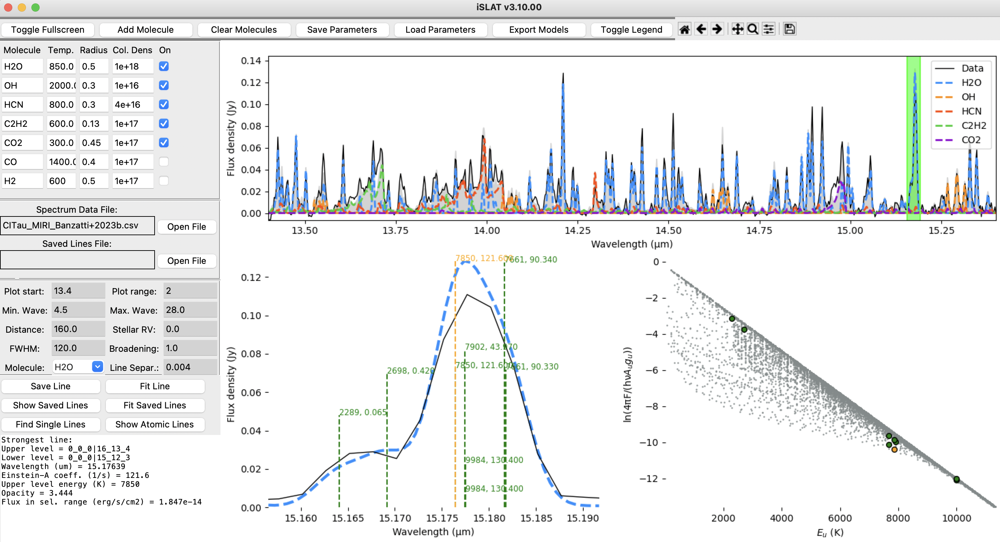

# iSLAT
**iSLAT** (the **i**nteractive **S**pectral-**L**ine **A**nalysis 
**T**ool) is a python package that provides an interactive interface
for the visualization, exploration, and analysis of molecular spectra.
Synthetic spectra are made using a simple slab model written by Simon 
Bruderer and originally described in [Banzatti et al. 2012](https://ui.adsabs.harvard.edu/abs/2012ApJ...745...90B/abstract);
the code uses molecular data from [HITRAN](https://hitran.org/).
iSLAT has been developed and currently tested on spectra at infrared wavelengths 
as observed at different resolving powers (R = 700-90,000) with: 
JWST-MIRI, Spitzer-IRS, IRTF-ISHELL. Examples of these spectra are
included for users to practice with the tool functionalities across 
a range of resolving powers. iSLAT has been built as a flexible
tool that should work with one-dimensional molecular spectra observed 
with other instruments too, provided some requirements are met (see below).
iSLAT is presented and described in [Jellison et al. 2024](...); 
a screenshot of iSLAT's GUI is provided here:

*We built iSLAT to make the analysis of infrared molecular spectra
an accessible, enjoyable, and rewarding experience for all, including
the youngest students who are starting in the field today. We 
believe iSLAT will be useful to many students and professional researchers,
and we will continue to support it and expand it with care for all users.
If you find a bug, please be patient and let us know; we want to fix
it as much as you do! And if you have ideas to improve the tool, 
we'd love to hear.*

Questions? Feedback? Contributions? Submit an issue, a pull request,
or email us at spexodisks@gmail.com

## Installation and updates

### Download and run the latest version from GitHub:

Make sure you have [git](https://github.com/git-guides/install-git) and [pip](https://pip.pypa.io/en/stable/installation/) installed, 
then run these terminal commands sequentially from within the
folder where you wish your local copy of iSLAT to be:

    git clone https://github.com/spexod/iSLAT
    cd iSLAT
    pip install -r requirements.txt

To launch iSLAT, simply type:

    cd iSLAT
    python iSLAT.py

### Update to the latest version from GitHub:

Remember to update the repository from GitHub from time to time;
from your local iSLAT folder type on terminal:

    git pull https://github.com/spexod/iSLAT

## Input and outputs
iSLAT requires a flat, continuum-subtracted spectrum as input data 
file in csv format, with a wavelength array in μm ("wave") and flux 
array in Jy ("flux"). The step of subtracting the continuum can be
done e.g. with this tool: [ctool](https://github.com/pontoppi/ctool).
The outputs are txt or csv files that save model parameters, spectra,
or line lists as defined by users (see more below). User model parameter
saves (using the function "Save Parameters") are stored in the folder
iSLAT/SAVES.

## HITRAN data
At first launch by the user, iSLAT will download from [HITRAN](https://hitran.org/) the data
for a default list of molecules: H2, H2O, CO, 
CO2, CH4, HCN, NH3, OH, 
C2H2, C2H4, 
C2H6, C4H2, 
HCN, HC3N and their main isotopologues. 
These datafiles are stored into the folder "HITRANdata" and are available to 
load and use in iSLAT (see below). We are currently developing
an interface function to allow users to download any other molecule 
by request. The current HITRAN data release as of 2024 is described in 
[Gordon et al. 2022](https://ui.adsabs.harvard.edu/abs/2022JQSRT.27707949G/abstract).

## Parameters definitions and units
**General note for all parameters in the GUI:** *every time you update any 
value, hit "return/enter" on your keyboard to apply the new value to the model.
This has to be done for each parameter individually, e.g. when submitting 
a new temperature for a given molecule, or updating the distance for given object.
A confirmation will appear in the message box in iSLAT.*

- **Molecular model parameters**: temperature is in K, radius in au (this is the 
radius of the equivalent emitting area, not the orbital radius of the 
emission), column density in cm-2. 
- Other parameters: 
  - **Plot start/range** (just for the plot) and 
  **min/max wavelength** (the spectral range
  for computing the model) are in μm
  - **Distance** is in pc
  - **Stellar RV** is Heliocentric and in km/s, and will shift the observed 
  spectrum (not the model)
  - line **FWHM** is in km/s, and is used in convolution of the model to
  match the observed line widths
  - line **broadening** is in km/s and is the FWHM of the intrinsic line
  broadening due to thermal motion or turbulence
  - **line separation** is in μm, and is used to identify isolated lines
  in the model for the molecule selected in the drop-down menu

## Quick reference for main functions
### General functions (top of the GUI)
- **Add molecule**: loads a molecule into the list of available molecules
at the top left of the GUI; the new molecule must already be downloaded
from HITRAN and stored in a .par file in the folder "HITRANdata"
- **Clear molecules**: removes any additional molecules and leaves the 
default ones only
- **Save parameters**: save in an output file the current model parameters 
(T, R, N) for each molecule; the output file will have the same name 
as the input observed spectrum plus "-save.txt" and will be stored in
the folder iSLAT/SAVES
- **Load parameters**: loads previously saved model parameters from output
file created with "Save Parameters" from the folder iSLAT/SAVES
- **Export models**: export a specific or all model spectra in an output 
csv file

### Spectral analysis functions
- **Selecting a line**: by dragging a region in the top spectrum plot, the
spectral region gets visualized in the bottom left plot with the 
addition of the individual transitions that dominate the emission;
the strongest of these transitions is highlighted in orange and its
properties are reported in the text box at the bottom left of the GUI
- **Save line**: save strongest line currently selected into an output 
csv file that will include all the line parameters; this function
needs the selection/definition of an output file from the folder 
LINESAVES under "Saved lines file"
- **Fit line**: fit selected line with a Gaussian function using [LMFIT](https://lmfit.github.io/lmfit-py/index.html);
full fit results are reported in the terminal, while a selection in
the text box
- **Show saved lines**: marks lines saved into the output file selected 
under "Saved lines file"
- **Show atomic lines**: marks and labels atomic lines from the list 
saved in the folder ATOMLINES
- **Find single lines**: identifies and marks isolated lines using
the parameter "Line separ." as their spectral separation
- **Molecule drop-down menu**: select which molecule is considered for
the zoomed-in plot and the rotation diagram, and for the "Find single
lines" function

## Data examples
iSLAT's release includes some continuum-subtracted spectra of 
protoplanetary disks that users can use to get familiar with iSLAT 
and its applications across a range of resolving powers:
- one M-band spectrum from iSHELL with R~60,000 (FZ Tau) from [Banzatti et al. 2023a](https://ui.adsabs.harvard.edu/abs/2023AJ....165...72B/abstract)
- two spectra from MIRI with R~2000-3000 (CI Tau and FZ Tau) from [Banzatti et al. 2023b](https://ui.adsabs.harvard.edu/abs/2023ApJ...957L..22B/abstract)
and [Pontoppidan et al. 2024](https://ui.adsabs.harvard.edu/abs/2023arXiv231117020P/abstract), respectively
- one spectrum from Spitzer-IRS with R~700 (CI Tau) from [Banzatti et al. 2020](https://ui.adsabs.harvard.edu/abs/2020ApJ...903..124B/abstract)
, reduced as described in [Pontoppidan et al. 2010](https://ui.adsabs.harvard.edu/abs/2010ApJ...720..887P/abstract)

The original spectra (not continuum-subtracted) are available on
[spexodisks.com](www.spexodisks.com). Users who wish to use any of these spectra 
in their research work should use the original data and cite the
original publication papers.

## Known issues
If you use iSLAT on an Apple-silicon Mac, there is a known issue with 
tkinter where the GUI often does not take a new input or click; the
solution is to "wake up" the GUI by slightly resizing it window in 
any way. Sometimes even just moving the GUI window around for a 
moment will do the trick. Hopefully this will be fixed in a new
release of tkinter (this is not an issue of iSLAT).

## Acknowledging iSLAT
If you use iSLAT in your research, please add its citation 
in any publications and oral/poster presentations. The main reference
to cite is: [Jellison et al. 2024](...)
